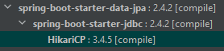

# Database auto-reconnection

The purpose of this little project is to validate the capabilities
of [HikariCP](https://github.com/brettwooldridge/HikariCP) library included by default
in [spring-boot-data-jpa](https://spring.io/guides/gs/accessing-data-jpa/).



### Analyzed points:

* Is there any custom configuration needed?
* How timeout works?
* How does it affect the health check?
* Can it work with liquibase?
* What happen if the connection pool is flooded of request during the database outage?

## How to run locally?

With the profile `h2` the service starts with an embedded h2 database.

    mvn clean package -DskipTests && java -jar ./target/*.jar --spring.profiles.active=h2

It runs liquibase and all the endpoint are available, but you cannot shutdown and restart the database to provide the
auto reconnection.

The best way to test locally is with a real database, or even better with a dockerized one.

### How to run Postgre in a docker container

Because I always forget how to run the PostgreSQL container, let's keep here the commands to run it in a docker container.

```
docker run --name postgres01 -e POSTGRES_PASSWORD=mysecretpassword -p 5432:5432 -d postgres
```

## Integration test with Testcontainers

Here an extensive test to prove the all the expectations:

1. the testing library `Testcontainers` allows to simplify the manual steps of setup of docker database
1. the `JpaRepository` inserts two rows in the database, they are retrieved later
1. the `isHealthy()` method checks if the service is healthy using the endpoint exposed
   by [spring-boot-actuators](https://docs.spring.io/spring-boot/docs/current/reference/html/production-ready-features.html#production-ready-health)
1. it retrieves the previously inserted rows
1. now the container is paused. If you stop and restart the port may change, and the service is no more able to connect.
1. the `isHealthy()` shows that the service is not more healthy
1. the next 20 requests for retrieving the rows run in parallel to completely fill the connection pool
1. the `isHealthy()` shows that the service is still not healthy
1. as soon as the container is unpaused, the service is again healty
1. it can connect to the database to retrieve the rows

```java

@Testcontainers
@SpringBootTest(webEnvironment = WebEnvironment.RANDOM_PORT)
class DbAutoReconnectApplicationTests {

   @Container
   private static final PostgreSQLContainer db = new PostgreSQLContainer("postgres:11.1");

   @Test
   void contextLoads() {
      log.info("Starting tests on port {}.", port);

      log.info("Saving two rows in the database...");
      repo.save(new DbEntity("first"));
      repo.save(new DbEntity("second"));
      log.info(" ... done: {}", repo.findAll());

      assertThat(isHealthy(), is(true));
      assertThat(getEntityIdsFromDb(), hasSize(2));

      pause(db);

      assertThat(isHealthy(), is(false));
      System.setProperty("java.util.concurrent.ForkJoinPool.common.parallelism", "20");
      IntStream.range(1, 20).parallel().forEach(
              i -> assertThat(getEntityIdsFromDb(), is(nullValue()))
      );
      assertThat(isHealthy(), is(false));

      unpause(db);

      assertThat(isHealthy(), is(true));
      assertThat(getEntityIdsFromDb(), hasSize(2));
      assertThat(isHealthy(), is(true));
   }

   /* omitted */

   @SneakyThrows
   private boolean isHealthy() {
      var healthEntity = template.getForEntity("http://localhost:{port}/actuator/health", StatusWrapper.class, port);
      log.info("Health check http status is {} and status is {}", healthEntity.getStatusCode(), healthEntity.getBody().getStatus());
      if (healthEntity.getBody().getComponent() != null) {
         log.info(" ... and database details: {}", healthEntity.getBody().getComponent().getDb().getDetails());
      }
      return healthEntity.getStatusCode().is2xxSuccessful();
   }

   @SneakyThrows
   private List<String> getEntityIdsFromDb() {
      var idsEntity = template.getForEntity("http://localhost:{port}/entities", String.class, port);
      log.info("Query for database entities has status {}", idsEntity.getStatusCode());
      log.info(" ... and entity body: {}", idsEntity.getBody());
      TypeReference<List<String>> listOfStringType = new TypeReference<>() {
      };
      return idsEntity.getStatusCode().is2xxSuccessful() ? objectMapper.readValue(idsEntity.getBody(), listOfStringType) : null;
   }
}
```

Output in my local machine:

```
.   ____          _            __ _ _
/\\ / ___'_ __ _ _(_)_ __  __ _ \ \ \ \
( ( )\___ | '_ | '_| | '_ \/ _` | \ \ \ \
\\/  ___)| |_)| | | | | || (_| |  ) ) ) )
'  |____| .__|_| |_|_| |_\__, | / / / /
=========|_|==============|___/=/_/_/_/
:: Spring Boot ::                (v2.4.2)

INFO i.m.d.DbAutoReconnectApplicationTests    : Setting up the datasource using url jdbc:postgresql://192.168.99.100:32825/test?loggerLevel=OFF.
INFO i.m.d.DbAutoReconnectApplicationTests    : Starting DbAutoReconnectApplicationTests using Java 15.0.1 on Omen with PID 18016 (started by Alberto in C:\dev\java-workspace\db-auto-reconnect)
INFO i.m.d.DbAutoReconnectApplicationTests    : No active profile set, falling back to default profiles: default
INFO .s.d.r.c.RepositoryConfigurationDelegate : Bootstrapping Spring Data JPA repositories in DEFAULT mode.
INFO .s.d.r.c.RepositoryConfigurationDelegate : Finished Spring Data repository scanning in 31 ms. Found 1 JPA repository interfaces.
INFO o.s.b.w.embedded.tomcat.TomcatWebServer  : Tomcat initialized with port(s): 0 (http)
INFO o.apache.catalina.core.StandardService   : Starting service [Tomcat]
INFO org.apache.catalina.core.StandardEngine  : Starting Servlet engine: [Apache Tomcat/9.0.41]
INFO o.a.c.c.C.[Tomcat].[localhost].[/]       : Initializing Spring embedded WebApplicationContext
INFO w.s.c.ServletWebServerApplicationContext : Root WebApplicationContext: initialization completed in 1654 ms
WARN com.zaxxer.hikari.HikariConfig           : HikariPool-1 - idleTimeout has been set but has no effect because the pool is operating as a fixed size pool.
INFO com.zaxxer.hikari.HikariDataSource       : HikariPool-1 - Starting...
INFO com.zaxxer.hikari.HikariDataSource       : HikariPool-1 - Start completed.
INFO liquibase.lockservice                    : Successfully acquired change log lock
INFO liquibase.changelog                      : Creating database history table with name: public.databasechangelog
INFO liquibase.changelog                      : Reading from public.databasechangelog
INFO liquibase.changelog                      : Table SIMPLE_TABLE created
INFO liquibase.changelog                      : ChangeSet db.changelog-1.0-xml::init-db::Alberto ran successfully in 7ms
INFO liquibase.lockservice                    : Successfully released change log lock
INFO o.hibernate.jpa.internal.util.LogHelper  : HHH000204: Processing PersistenceUnitInfo [name: default]
INFO org.hibernate.Version                    : HHH000412: Hibernate ORM core version 5.4.27.Final
INFO o.hibernate.annotations.common.Version   : HCANN000001: Hibernate Commons Annotations {5.1.2.Final}
INFO org.hibernate.dialect.Dialect            : HHH000400: Using dialect: org.hibernate.dialect.PostgreSQL10Dialect
INFO o.h.e.t.j.p.i.JtaPlatformInitiator       : HHH000490: Using JtaPlatform implementation: [org.hibernate.engine.transaction.jta.platform.internal.NoJtaPlatform]
INFO j.LocalContainerEntityManagerFactoryBean : Initialized JPA EntityManagerFactory for persistence unit 'default'
INFO o.s.s.concurrent.ThreadPoolTaskExecutor  : Initializing ExecutorService 'applicationTaskExecutor'
INFO o.s.b.a.e.web.EndpointLinksResolver      : Exposing 2 endpoint(s) beneath base path '/actuator'
INFO o.s.b.w.embedded.tomcat.TomcatWebServer  : Tomcat started on port(s): 30859 (http) with context path ''
INFO i.m.d.DbAutoReconnectApplicationTests    : Started DbAutoReconnectApplicationTests in 5.295 seconds (JVM running for 10.124)

... Actual test starts here ...

INFO i.m.d.DbAutoReconnectApplicationTests    : Starting tests on port 30859.
INFO i.m.d.DbAutoReconnectApplicationTests    : Saving two rows in the database...
INFO i.m.d.DbAutoReconnectApplicationTests    :  ... done: [DbEntity[id='first'], DbEntity[id='second']]
INFO o.a.c.c.C.[Tomcat].[localhost].[/]       : Initializing Spring DispatcherServlet 'dispatcherServlet'
INFO o.s.web.servlet.DispatcherServlet        : Initializing Servlet 'dispatcherServlet'
INFO o.s.web.servlet.DispatcherServlet        : Completed initialization in 1 ms
INFO i.m.d.DbAutoReconnectApplicationTests    : Health check http status is 200 OK and status is UP
INFO it.minetti.dbautoreconnect.Controller    : Requested all Db Entities
INFO i.m.d.DbAutoReconnectApplicationTests    : Query for database entities has status 200 OK
INFO i.m.d.DbAutoReconnectApplicationTests    :  ... and entity body: ["first","second"]
INFO i.m.d.DbAutoReconnectApplicationTests    : Pausing container postgres:11.1 ...
INFO i.m.d.DbAutoReconnectApplicationTests    :  ... paused.
WARN com.zaxxer.hikari.pool.PoolBase          : HikariPool-1 - Failed to validate connection org.postgresql.jdbc.PgConnection@1dcaa173 (This connection has been closed.). Possibly consider using a shorter maxLifetime value.
WARN o.s.b.a.jdbc.DataSourceHealthIndicator   : DataSource health check failed

org.springframework.jdbc.CannotGetJdbcConnectionException: Failed to obtain JDBC Connection; nested exception is java.sql.SQLTransientConnectionException: HikariPool-1 - Connection is not available, request timed out after 11001ms.
at org.springframework.jdbc.datasource.DataSourceUtils.getConnection(DataSourceUtils.java:82) ~[spring-jdbc-5.3.3.jar:5.3.3]
... (omitted)
at java.base/java.lang.Thread.run(Thread.java:832) ~[na:na]
Caused by: java.sql.SQLTransientConnectionException: HikariPool-1 - Connection is not available, request timed out after 11001ms.
at com.zaxxer.hikari.pool.HikariPool.createTimeoutException(HikariPool.java:695) ~[HikariCP-3.4.5.jar:na]
at com.zaxxer.hikari.pool.HikariPool.getConnection(HikariPool.java:197) ~[HikariCP-3.4.5.jar:na]
at com.zaxxer.hikari.pool.HikariPool.getConnection(HikariPool.java:162) ~[HikariCP-3.4.5.jar:na]
at com.zaxxer.hikari.HikariDataSource.getConnection(HikariDataSource.java:128) ~[HikariCP-3.4.5.jar:na]
at org.springframework.jdbc.datasource.DataSourceUtils.fetchConnection(DataSourceUtils.java:158) ~[spring-jdbc-5.3.3.jar:5.3.3]
at org.springframework.jdbc.datasource.DataSourceUtils.doGetConnection(DataSourceUtils.java:116) ~[spring-jdbc-5.3.3.jar:5.3.3]
at org.springframework.jdbc.datasource.DataSourceUtils.getConnection(DataSourceUtils.java:79) ~[spring-jdbc-5.3.3.jar:5.3.3]
... 78 common frames omitted
Caused by: org.postgresql.util.PSQLException: This connection has been closed.
at org.postgresql.jdbc.PgConnection.checkClosed(PgConnection.java:783) ~[postgresql-42.2.5.jar:42.2.5]
at org.postgresql.jdbc.PgConnection.setNetworkTimeout(PgConnection.java:1556) ~[postgresql-42.2.5.jar:42.2.5]
at com.zaxxer.hikari.pool.PoolBase.setNetworkTimeout(PoolBase.java:560) ~[HikariCP-3.4.5.jar:na]
at com.zaxxer.hikari.pool.PoolBase.isConnectionAlive(PoolBase.java:173) ~[HikariCP-3.4.5.jar:na]
at com.zaxxer.hikari.pool.HikariPool.getConnection(HikariPool.java:186) ~[HikariCP-3.4.5.jar:na]
... 83 common frames omitted

INFO i.m.d.DbAutoReconnectApplicationTests    : Health check http status is 503 SERVICE_UNAVAILABLE and status is DOWN
INFO it.minetti.dbautoreconnect.Controller    : Requested all Db Entities
INFO it.minetti.dbautoreconnect.Controller    : Requested all Db Entities
INFO it.minetti.dbautoreconnect.Controller    : Requested all Db Entities
INFO it.minetti.dbautoreconnect.Controller    : Requested all Db Entities
INFO it.minetti.dbautoreconnect.Controller    : Requested all Db Entities
INFO it.minetti.dbautoreconnect.Controller    : Requested all Db Entities
INFO it.minetti.dbautoreconnect.Controller    : Requested all Db Entities
INFO it.minetti.dbautoreconnect.Controller    : Requested all Db Entities
INFO it.minetti.dbautoreconnect.Controller    : Requested all Db Entities
INFO it.minetti.dbautoreconnect.Controller    : Requested all Db Entities
INFO it.minetti.dbautoreconnect.Controller    : Requested all Db Entities
INFO it.minetti.dbautoreconnect.Controller    : Requested all Db Entities
WARN o.h.engine.jdbc.spi.SqlExceptionHelper   : SQL Error: 0, SQLState: 08003
WARN o.h.engine.jdbc.spi.SqlExceptionHelper   : SQL Error: 0, SQLState: 08003
WARN o.h.engine.jdbc.spi.SqlExceptionHelper   : SQL Error: 0, SQLState: 08003
WARN o.h.engine.jdbc.spi.SqlExceptionHelper   : SQL Error: 0, SQLState: 08003
WARN o.h.engine.jdbc.spi.SqlExceptionHelper   : SQL Error: 0, SQLState: 08003
WARN o.h.engine.jdbc.spi.SqlExceptionHelper   : SQL Error: 0, SQLState: 08003
WARN o.h.engine.jdbc.spi.SqlExceptionHelper   : SQL Error: 0, SQLState: 08003
WARN o.h.engine.jdbc.spi.SqlExceptionHelper   : SQL Error: 0, SQLState: 08003
RROR o.h.engine.jdbc.spi.SqlExceptionHelper   : HikariPool-1 - Connection is not available, request timed out after 501ms.
RROR o.h.engine.jdbc.spi.SqlExceptionHelper   : HikariPool-1 - Connection is not available, request timed out after 501ms.
RROR o.h.engine.jdbc.spi.SqlExceptionHelper   : HikariPool-1 - Connection is not available, request timed out after 500ms.
RROR o.h.engine.jdbc.spi.SqlExceptionHelper   : HikariPool-1 - Connection is not available, request timed out after 500ms.
RROR o.h.engine.jdbc.spi.SqlExceptionHelper   : HikariPool-1 - Connection is not available, request timed out after 501ms.
RROR o.h.engine.jdbc.spi.SqlExceptionHelper   : HikariPool-1 - Connection is not available, request timed out after 500ms.
RROR o.h.engine.jdbc.spi.SqlExceptionHelper   : This connection has been closed.
RROR o.h.engine.jdbc.spi.SqlExceptionHelper   : This connection has been closed.
RROR o.h.engine.jdbc.spi.SqlExceptionHelper   : HikariPool-1 - Connection is not available, request timed out after 500ms.
RROR o.h.engine.jdbc.spi.SqlExceptionHelper   : This connection has been closed.
RROR o.h.engine.jdbc.spi.SqlExceptionHelper   : HikariPool-1 - Connection is not available, request timed out after 500ms.
RROR o.h.engine.jdbc.spi.SqlExceptionHelper   : This connection has been closed.
RROR o.h.engine.jdbc.spi.SqlExceptionHelper   : This connection has been closed.
RROR o.h.engine.jdbc.spi.SqlExceptionHelper   : This connection has been closed.
RROR o.h.engine.jdbc.spi.SqlExceptionHelper   : This connection has been closed.
RROR o.h.engine.jdbc.spi.SqlExceptionHelper   : This connection has been closed.
INFO i.m.d.DbAutoReconnectApplicationTests    : Query for database entities has status 503 SERVICE_UNAVAILABLE
INFO i.m.d.DbAutoReconnectApplicationTests    : Query for database entities has status 503 SERVICE_UNAVAILABLE
INFO i.m.d.DbAutoReconnectApplicationTests    : Query for database entities has status 503 SERVICE_UNAVAILABLE
INFO i.m.d.DbAutoReconnectApplicationTests    : Query for database entities has status 503 SERVICE_UNAVAILABLE
INFO i.m.d.DbAutoReconnectApplicationTests    : Query for database entities has status 503 SERVICE_UNAVAILABLE
INFO i.m.d.DbAutoReconnectApplicationTests    : Query for database entities has status 503 SERVICE_UNAVAILABLE
INFO i.m.d.DbAutoReconnectApplicationTests    :  ... and entity body: {"message":"HikariPool-1 - Connection is not available, request timed out after 500ms."}
INFO i.m.d.DbAutoReconnectApplicationTests    :  ... and entity body: {"message":"HikariPool-1 - Connection is not available, request timed out after 501ms."}
INFO i.m.d.DbAutoReconnectApplicationTests    :  ... and entity body: {"message":"HikariPool-1 - Connection is not available, request timed out after 501ms."}
INFO i.m.d.DbAutoReconnectApplicationTests    :  ... and entity body: {"message":"HikariPool-1 - Connection is not available, request timed out after 500ms."}
INFO i.m.d.DbAutoReconnectApplicationTests    :  ... and entity body: {"message":"HikariPool-1 - Connection is not available, request timed out after 500ms."}
INFO i.m.d.DbAutoReconnectApplicationTests    :  ... and entity body: {"message":"HikariPool-1 - Connection is not available, request timed out after 500ms."}
INFO i.m.d.DbAutoReconnectApplicationTests    : Query for database entities has status 503 SERVICE_UNAVAILABLE
INFO i.m.d.DbAutoReconnectApplicationTests    :  ... and entity body: {"message":"HikariPool-1 - Connection is not available, request timed out after 500ms."}
INFO i.m.d.DbAutoReconnectApplicationTests    : Query for database entities has status 503 SERVICE_UNAVAILABLE
INFO i.m.d.DbAutoReconnectApplicationTests    :  ... and entity body: {"message":"HikariPool-1 - Connection is not available, request timed out after 501ms."}
INFO it.minetti.dbautoreconnect.Controller    : Requested all Db Entities
INFO it.minetti.dbautoreconnect.Controller    : Requested all Db Entities
INFO it.minetti.dbautoreconnect.Controller    : Requested all Db Entities
INFO it.minetti.dbautoreconnect.Controller    : Requested all Db Entities
INFO it.minetti.dbautoreconnect.Controller    : Requested all Db Entities
INFO it.minetti.dbautoreconnect.Controller    : Requested all Db Entities
INFO it.minetti.dbautoreconnect.Controller    : Requested all Db Entities
WARN com.zaxxer.hikari.pool.PoolBase          : HikariPool-1 - Failed to validate connection org.postgresql.jdbc.PgConnection@6a8e88a (This connection has been closed.). Possibly consider using a shorter maxLifetime value.
WARN o.h.engine.jdbc.spi.SqlExceptionHelper   : SQL Error: 0, SQLState: 08003
RROR o.h.engine.jdbc.spi.SqlExceptionHelper   : HikariPool-1 - Connection is not available, request timed out after 1000ms.
RROR o.h.engine.jdbc.spi.SqlExceptionHelper   : This connection has been closed.
WARN com.zaxxer.hikari.pool.PoolBase          : HikariPool-1 - Failed to validate connection org.postgresql.jdbc.PgConnection@5b5239ff (This connection has been closed.). Possibly consider using a shorter maxLifetime value.
WARN com.zaxxer.hikari.pool.PoolBase          : HikariPool-1 - Failed to validate connection org.postgresql.jdbc.PgConnection@70bfc29d (This connection has been closed.). Possibly consider using a shorter maxLifetime value.
WARN o.h.engine.jdbc.spi.SqlExceptionHelper   : SQL Error: 0, SQLState: 08003
RROR o.h.engine.jdbc.spi.SqlExceptionHelper   : HikariPool-1 - Connection is not available, request timed out after 1001ms.
RROR o.h.engine.jdbc.spi.SqlExceptionHelper   : This connection has been closed.
WARN o.h.engine.jdbc.spi.SqlExceptionHelper   : SQL Error: 0, SQLState: 08003
RROR o.h.engine.jdbc.spi.SqlExceptionHelper   : HikariPool-1 - Connection is not available, request timed out after 1000ms.
RROR o.h.engine.jdbc.spi.SqlExceptionHelper   : This connection has been closed.
INFO i.m.d.DbAutoReconnectApplicationTests    : Query for database entities has status 503 SERVICE_UNAVAILABLE
INFO i.m.d.DbAutoReconnectApplicationTests    :  ... and entity body: {"message":"HikariPool-1 - Connection is not available, request timed out after 1000ms."}
INFO i.m.d.DbAutoReconnectApplicationTests    : Query for database entities has status 503 SERVICE_UNAVAILABLE
INFO i.m.d.DbAutoReconnectApplicationTests    :  ... and entity body: {"message":"HikariPool-1 - Connection is not available, request timed out after 1001ms."}
INFO i.m.d.DbAutoReconnectApplicationTests    : Query for database entities has status 503 SERVICE_UNAVAILABLE
INFO i.m.d.DbAutoReconnectApplicationTests    :  ... and entity body: {"message":"HikariPool-1 - Connection is not available, request timed out after 1000ms."}
WARN o.h.engine.jdbc.spi.SqlExceptionHelper   : SQL Error: 0, SQLState: 08003
WARN o.h.engine.jdbc.spi.SqlExceptionHelper   : SQL Error: 0, SQLState: 08003
WARN o.h.engine.jdbc.spi.SqlExceptionHelper   : SQL Error: 0, SQLState: 08003
RROR o.h.engine.jdbc.spi.SqlExceptionHelper   : HikariPool-1 - Connection is not available, request timed out after 501ms.
RROR o.h.engine.jdbc.spi.SqlExceptionHelper   : HikariPool-1 - Connection is not available, request timed out after 501ms.
RROR o.h.engine.jdbc.spi.SqlExceptionHelper   : HikariPool-1 - Connection is not available, request timed out after 501ms.
WARN o.h.engine.jdbc.spi.SqlExceptionHelper   : SQL Error: 0, SQLState: 08003
RROR o.h.engine.jdbc.spi.SqlExceptionHelper   : This connection has been closed.
RROR o.h.engine.jdbc.spi.SqlExceptionHelper   : This connection has been closed.
WARN o.h.engine.jdbc.spi.SqlExceptionHelper   : SQL Error: 0, SQLState: 08003
WARN o.h.engine.jdbc.spi.SqlExceptionHelper   : SQL Error: 0, SQLState: 08003
RROR o.h.engine.jdbc.spi.SqlExceptionHelper   : HikariPool-1 - Connection is not available, request timed out after 501ms.
RROR o.h.engine.jdbc.spi.SqlExceptionHelper   : This connection has been closed.
RROR o.h.engine.jdbc.spi.SqlExceptionHelper   : HikariPool-1 - Connection is not available, request timed out after 501ms.
WARN o.h.engine.jdbc.spi.SqlExceptionHelper   : SQL Error: 0, SQLState: 08003
RROR o.h.engine.jdbc.spi.SqlExceptionHelper   : This connection has been closed.
RROR o.h.engine.jdbc.spi.SqlExceptionHelper   : HikariPool-1 - Connection is not available, request timed out after 501ms.
RROR o.h.engine.jdbc.spi.SqlExceptionHelper   : HikariPool-1 - Connection is not available, request timed out after 501ms.
RROR o.h.engine.jdbc.spi.SqlExceptionHelper   : This connection has been closed.
RROR o.h.engine.jdbc.spi.SqlExceptionHelper   : This connection has been closed.
RROR o.h.engine.jdbc.spi.SqlExceptionHelper   : This connection has been closed.
INFO i.m.d.DbAutoReconnectApplicationTests    : Query for database entities has status 503 SERVICE_UNAVAILABLE
INFO i.m.d.DbAutoReconnectApplicationTests    : Query for database entities has status 503 SERVICE_UNAVAILABLE
INFO i.m.d.DbAutoReconnectApplicationTests    : Query for database entities has status 503 SERVICE_UNAVAILABLE
INFO i.m.d.DbAutoReconnectApplicationTests    :  ... and entity body: {"message":"HikariPool-1 - Connection is not available, request timed out after 501ms."}
INFO i.m.d.DbAutoReconnectApplicationTests    :  ... and entity body: {"message":"HikariPool-1 - Connection is not available, request timed out after 501ms."}
INFO i.m.d.DbAutoReconnectApplicationTests    : Query for database entities has status 503 SERVICE_UNAVAILABLE
INFO i.m.d.DbAutoReconnectApplicationTests    :  ... and entity body: {"message":"HikariPool-1 - Connection is not available, request timed out after 501ms."}
INFO i.m.d.DbAutoReconnectApplicationTests    :  ... and entity body: {"message":"HikariPool-1 - Connection is not available, request timed out after 501ms."}
INFO i.m.d.DbAutoReconnectApplicationTests    : Query for database entities has status 503 SERVICE_UNAVAILABLE
INFO i.m.d.DbAutoReconnectApplicationTests    :  ... and entity body: {"message":"HikariPool-1 - Connection is not available, request timed out after 501ms."}
INFO i.m.d.DbAutoReconnectApplicationTests    : Query for database entities has status 503 SERVICE_UNAVAILABLE
INFO i.m.d.DbAutoReconnectApplicationTests    : Query for database entities has status 503 SERVICE_UNAVAILABLE
INFO i.m.d.DbAutoReconnectApplicationTests    :  ... and entity body: {"message":"HikariPool-1 - Connection is not available, request timed out after 501ms."}
INFO i.m.d.DbAutoReconnectApplicationTests    :  ... and entity body: {"message":"HikariPool-1 - Connection is not available, request timed out after 501ms."}
WARN com.zaxxer.hikari.pool.PoolBase          : HikariPool-1 - Failed to validate connection org.postgresql.jdbc.PgConnection@7b728e68 (This connection has been closed.). Possibly consider using a shorter maxLifetime value.
WARN o.h.engine.jdbc.spi.SqlExceptionHelper   : SQL Error: 0, SQLState: 08003
RROR o.h.engine.jdbc.spi.SqlExceptionHelper   : HikariPool-1 - Connection is not available, request timed out after 11001ms.
RROR o.h.engine.jdbc.spi.SqlExceptionHelper   : This connection has been closed.
INFO i.m.d.DbAutoReconnectApplicationTests    : Query for database entities has status 503 SERVICE_UNAVAILABLE
INFO i.m.d.DbAutoReconnectApplicationTests    :  ... and entity body: {"message":"HikariPool-1 - Connection is not available, request timed out after 11001ms."}
WARN o.s.b.a.jdbc.DataSourceHealthIndicator   : DataSource health check failed

org.springframework.jdbc.CannotGetJdbcConnectionException: Failed to obtain JDBC Connection; nested exception is java.sql.SQLTransientConnectionException: HikariPool-1 - Connection is not available, request timed out after 501ms.
at org.springframework.jdbc.datasource.DataSourceUtils.getConnection(DataSourceUtils.java:82) ~[spring-jdbc-5.3.3.jar:5.3.3]
at org.springframework.jdbc.core.JdbcTemplate.execute(JdbcTemplate.java:330) ~[spring-jdbc-5.3.3.jar:5.3.3]
... (omitted)
at java.base/java.lang.Thread.run(Thread.java:832) ~[na:na]
Caused by: java.sql.SQLTransientConnectionException: HikariPool-1 - Connection is not available, request timed out after 501ms.
at com.zaxxer.hikari.pool.HikariPool.createTimeoutException(HikariPool.java:695) ~[HikariCP-3.4.5.jar:na]
at com.zaxxer.hikari.pool.HikariPool.getConnection(HikariPool.java:197) ~[HikariCP-3.4.5.jar:na]
at com.zaxxer.hikari.pool.HikariPool.getConnection(HikariPool.java:162) ~[HikariCP-3.4.5.jar:na]
at com.zaxxer.hikari.HikariDataSource.getConnection(HikariDataSource.java:128) ~[HikariCP-3.4.5.jar:na]
at org.springframework.jdbc.datasource.DataSourceUtils.fetchConnection(DataSourceUtils.java:158) ~[spring-jdbc-5.3.3.jar:5.3.3]
at org.springframework.jdbc.datasource.DataSourceUtils.doGetConnection(DataSourceUtils.java:116) ~[spring-jdbc-5.3.3.jar:5.3.3]
at org.springframework.jdbc.datasource.DataSourceUtils.getConnection(DataSourceUtils.java:79) ~[spring-jdbc-5.3.3.jar:5.3.3]
... 78 common frames omitted
Caused by: org.postgresql.util.PSQLException: This connection has been closed.
at org.postgresql.jdbc.PgConnection.checkClosed(PgConnection.java:783) ~[postgresql-42.2.5.jar:42.2.5]
at org.postgresql.jdbc.PgConnection.setNetworkTimeout(PgConnection.java:1556) ~[postgresql-42.2.5.jar:42.2.5]
... (omitted)
at it.minetti.dbautoreconnect.$Proxy123.findAll(Unknown Source) ~[na:na]
at it.minetti.dbautoreconnect.Controller.get(Controller.java:27) ~[classes/:na]
... 54 common frames omitted

INFO i.m.d.DbAutoReconnectApplicationTests    : Health check http status is 503 SERVICE_UNAVAILABLE and status is DOWN
INFO i.m.d.DbAutoReconnectApplicationTests    : Unpausing container postgres:11.1 ...
INFO i.m.d.DbAutoReconnectApplicationTests    :  ... unpaused.
INFO i.m.d.DbAutoReconnectApplicationTests    : Health check http status is 200 OK and status is UP
INFO it.minetti.dbautoreconnect.Controller    : Requested all Db Entities
INFO i.m.d.DbAutoReconnectApplicationTests    : Query for database entities has status 200 OK
INFO i.m.d.DbAutoReconnectApplicationTests    :  ... and entity body: ["first","second"]
INFO i.m.d.DbAutoReconnectApplicationTests    : Health check http status is 200 OK and status is UP
INFO o.s.s.concurrent.ThreadPoolTaskExecutor  : Shutting down ExecutorService 'applicationTaskExecutor'
INFO j.LocalContainerEntityManagerFactoryBean : Closing JPA EntityManagerFactory for persistence unit 'default'
INFO com.zaxxer.hikari.HikariDataSource       : HikariPool-1 - Shutdown initiated...
INFO com.zaxxer.hikari.HikariDataSource       : HikariPool-1 - Shutdown completed.

Process finished with exit code 0
```